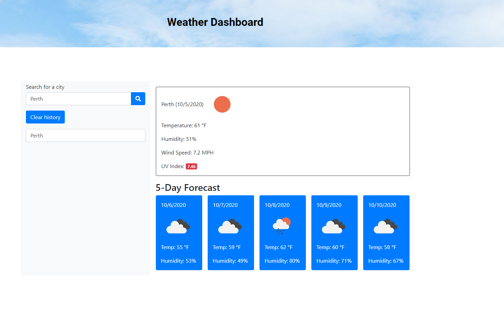

# Password-Generator
Application that generates the current weather and a 5 Day Forecast based on the user's location. 
 
 
## Table of contents
* [General Info](#General-Info)
* [Technologies](#Technologies)
* [Screenshot](#Screenshot)
* [Setup](#Setup)
* [Improvement](#Improvement)

 

### General Info

Application that generates the current weather and a 5 Day Forecast based on the user's location.  
This app runs in the browser and features dynamically updated HTML and CSS powered by JavaScript code. It also features a clean and polished user interface and be responsive, ensuring that it adapts to multiple screen sizes.

 

### Technologies
<ul>
<li>Javascript
<li>CSS
<li>HTML
<li>JQuery
<li>Bootstrap
<li>Openweather API
</ul>

 

### Screenshot 

 

 

### Setup

When on landing page (see screenshot) user will be ask to type a city name into the input area and click on the search button.
 
The Result is displaying the City Name, the current date, the Temperature, Humidity, Wind Speed and UV Index.
 

Up to 5 entries of search history are being saved for the User to review.

Does the User click on "Clear History" these Search Results, the local storage and the html page will be cleared.

### Improvement

* Each Search History could be generated as a button, the User can click and the location being searched for.
* There could be a button generating the current location of the User
* Display an image instead of having a blank result area
* Metric display not working

